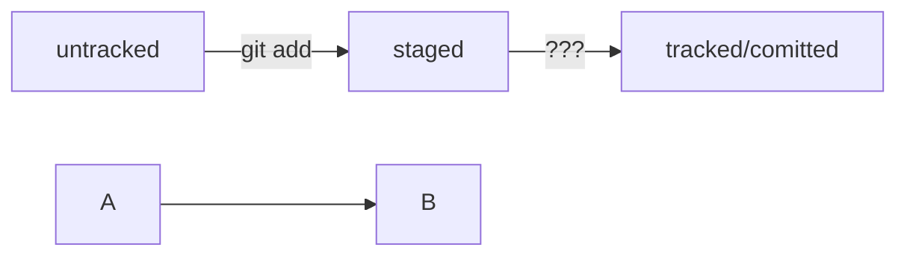

# Саздат

`git init`

# Дабавит

`git add --all`

# Вкинуть

`git commit -m 'Оформлен вкид'`

# Вкинуть на гитхаб

`git push`

# Хеш

ну это идентификатор комита короче

# лог

ну это список комитов

# HEAD 

это последний коммит

# Статусы

Есть стагед, трэкед, антрекед и модифиед.

# Крутая схемка

